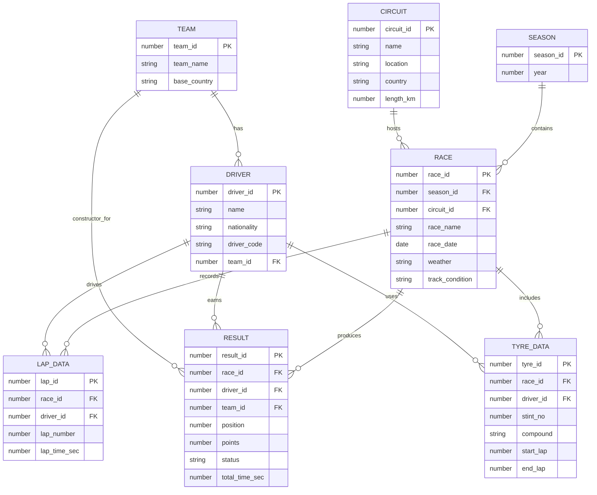

# ER Model

## Entities and Attributes

### Season

- `SeasonID` - primary key
- `Year` - unique championship year

### Circuit

- `CircuitID` - primary key
- `Name`
- `Location`
- `Country`
- `LengthKm`

### Team

- `TeamID` - primary key
- `TeamName`
- `BaseCountry`

### Driver

- `DriverID` - primary key
- `Name`
- `Nationality`
- `DriverCode`
- `TeamID` - optional current/default team reference

### Race

- `RaceID` - primary key
- `SeasonID` - foreign key
- `CircuitID` - foreign key
- `RaceName`
- `RaceDate`
- `Weather`
- `TrackCondition`

### Result

- `ResultID` - primary key
- `RaceID` - foreign key
- `DriverID` - foreign key
- `TeamID` - foreign key
- `Position`
- `Points`
- `Status`
- `TotalTimeSec`

### LapData

- `LapID` - primary key
- `RaceID` - foreign key
- `DriverID` - foreign key
- `LapNumber`
- `Sector1Sec`
- `Sector2Sec`
- `Sector3Sec`
- `LapTimeSec`
- `SpeedKmph`

### TyreData

- `TyreID` - primary key
- `RaceID` - foreign key
- `DriverID` - foreign key
- `StintNo`
- `Compound`
- `StartLap`
- `EndLap`

## Relationships and Cardinality

- One `Season` has many `Race` records.
- One `Circuit` can host many `Race` records across seasons.
- One `Team` can have many `Driver` records.
- One `Race` has many `Result` records.
- One `Driver` has many `Result` records.
- One `Team` has many `Result` records because constructor assignment is race-specific.
- One `Race` has many `LapData` records.
- One `Driver` has many `LapData` records.
- One `Race` has many `TyreData` records.
- One `Driver` has many `TyreData` records.

## Mermaid ER Diagram

