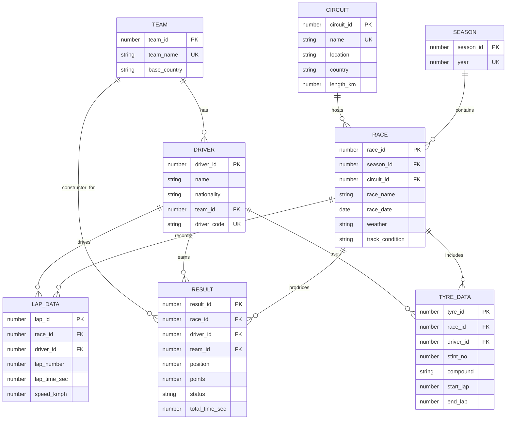

# Formula 1 Race Management & Performance Analytics System

**Project Synopsis and Final DBMS Report**  
**Course:** UCS310 - Database Management Systems  
**Degree:** B.Tech, 2nd Year  
**Department:** Computer Science and Engineering  
**Institute:** Thapar Institute of Engineering and Technology, Patiala - 147001  
**Academic Year:** 2025-26  

**Submitted By**

| Name | Roll Number |
| --- | --- |
| Sukhansh Mittal | 1024030318 |
| Vikramaditya Singh | 1024030315 |
| Ishjaap Singh | 1024030327 |

**Submitted To:** Diksha Arora

---

## Executive Summary

The Formula 1 Race Management & Performance Analytics System is a database-first project that models Formula 1 seasons, circuits, constructors, drivers, races, classified results, lap-time records, and tyre-stint windows using a normalized Oracle relational database.

The original synopsis proposed a Formula 1 race management system with a telemetry-inspired analytics layer. The completed implementation expands that idea into a full Oracle SQL and PL/SQL project using real 2021 and 2022 Formula 1 data from an Ergast-derived dataset, supported by analytical SQL queries and a React dashboard for presentation.

The system demonstrates core DBMS concepts including ER modeling, relational schema design, normalization up to 3NF, primary and foreign key constraints, check constraints, indexes, SQL views, joins, aggregation, analytical queries, triggers, procedures, functions, cursors, exception handling, and transaction control using `SAVEPOINT`, `ROLLBACK`, and `COMMIT`.

---

## Table of Contents

1. Introduction
2. Problem Statement
3. Objectives
4. Scope
5. Proposed System
6. Data Source and Dataset Coverage
7. Database Design
8. Relational Schema
9. Normalization
10. Database Implementation
11. PL/SQL Components
12. Transaction Management and Concurrency
13. Analytics Layer
14. Frontend Visualization Layer
15. Tools and Technologies
16. Expected Outcomes
17. Project Structure
18. Execution Guide
19. Synopsis Coverage Matrix
20. Conclusion

---

## 1. Introduction

Formula 1 is one of the most data-driven sports in the world. Race outcomes depend on drivers, constructors, circuits, qualifying position, lap pace, tyre strategy, reliability, race conditions, and execution under pressure. Because these factors are strongly connected, Formula 1 data is a strong use case for a relational database management system.

This project focuses on designing and implementing a Formula 1 race management and performance analytics database. The database stores official race-related data and supports telemetry-inspired performance analysis through lap-time records, fastest-lap queries, average pace comparison, constructor points, driver standings, and race result exploration.

A DBMS is preferred over file-based storage because Formula 1 data is relational by nature:

- A season contains multiple races.
- A race is held at one circuit.
- A driver competes for a constructor.
- A race produces multiple classified results.
- A driver records many laps in a race.
- A constructor earns points through its drivers.

Using Oracle SQL and PL/SQL ensures structured storage, faster querying, reduced redundancy, referential integrity, consistency, and support for analytical reporting.

---

## 2. Problem Statement

Managing and analyzing Formula 1 race data manually or through basic files is inefficient and error-prone. Race data involves multiple interconnected entities such as seasons, circuits, teams, drivers, race results, lap times, tyre windows, points, and standings. If this data is stored in spreadsheets or unstructured files, duplication and inconsistency become difficult to avoid.

### Limitations of Manual or File-Based Systems

| Limitation | Impact |
| --- | --- |
| Data redundancy | Driver, team, race, and circuit data may be repeated across multiple files. |
| Inconsistency | A change in one place may not be reflected elsewhere. |
| Poor relationship handling | Joins between drivers, teams, races, and results are difficult to manage manually. |
| Weak analytics support | Queries such as fastest lap, average pace, standings, and constructor points become tedious. |
| Limited scalability | More seasons and races increase file complexity rapidly. |
| Lack of integrity checks | Invalid results, missing references, and incorrect lap data may go undetected. |

This project solves these limitations by implementing a structured Oracle DBMS that stores Formula 1 race data in normalized tables and supports meaningful analytics through SQL and PL/SQL.

---

## 3. Objectives

The main objectives of the project are:

- To design an ER model for Formula 1 race management data.
- To convert the ER model into relational tables.
- To normalize the database up to Third Normal Form.
- To implement the database using Oracle SQL.
- To enforce data consistency using primary keys, foreign keys, unique constraints, and check constraints.
- To use SQL queries for race results, lap performance, driver analysis, and constructor analysis.
- To implement PL/SQL procedures, functions, triggers, cursors, and exception handling.
- To demonstrate transaction control using `SAVEPOINT`, `ROLLBACK`, and `COMMIT`.
- To provide a presentation layer that makes race analytics easy to explore.

---

## 4. Scope

### Functional Boundaries

The system covers:

- Storage of Formula 1 season data.
- Storage of circuit and race details.
- Storage of constructor/team details.
- Storage of driver details.
- Storage of classified race results.
- Storage of lap-time data.
- Storage of tyre-stint windows.
- Race result lookup by season and Grand Prix.
- Performance analytics using lap-time data.
- Driver and constructor standings analysis.
- Transaction management demonstration.
- Frontend dashboard for project demonstration.

### Users

| User Type | Role |
| --- | --- |
| Admin | Loads, maintains, and validates race data. |
| Analyst or Researcher | Runs queries to study race results, standings, lap pace, and team performance. |
| Viewer | Uses the frontend dashboard to inspect race and championship insights. |

### Project Modules

| Module | Description |
| --- | --- |
| Race Management Module | Stores seasons, circuits, teams, drivers, races, and results. |
| Performance Analytics Module | Supports fastest lap, average lap pace, race pace ranking, and standings analysis. |
| Telemetry-Inspired Data Module | Uses lap-time records and tyre-stint windows for performance comparison. |
| PL/SQL Automation Module | Implements triggers, functions, procedures, cursors, and exception handling. |
| Transaction Management Module | Demonstrates rollback, savepoints, commit, and ACID behavior. |
| Frontend Visualization Module | Presents the database output through an interactive React dashboard. |

---

## 5. Proposed System

The proposed system is a relational DBMS that stores Formula 1 race data and provides a telemetry-inspired analytics layer. The original synopsis proposed synthetic telemetry because real Formula 1 telemetry is proprietary. In the completed implementation, the project uses Ergast-derived historical lap-time data where available and generates demonstrative tyre-stint windows from pit-stop data.

### Key Features

- Normalized Oracle database schema.
- Storage of seasons, circuits, constructors, drivers, races, results, lap data, and tyre data.
- Primary key and foreign key based relationship management.
- Check constraints for domain validation.
- SQL views for simplified reporting.
- Analytical SQL queries using joins, aggregates, grouping, ordering, and window functions.
- PL/SQL triggers for validation and points automation.
- PL/SQL functions for average lap time and fastest lap driver lookup.
- PL/SQL procedures for race result insertion, standings output, and transaction demonstration.
- Cursor-based standings printing.
- Exception handling for duplicate records and missing data.
- Transaction management using savepoints, rollback, and commit.
- React dashboard for interactive race exploration and presentation.

---

## 6. Data Source and Dataset Coverage

The project uses a Formula 1 dataset derived from Ergast Motor Racing Data. The local project focuses on the 2021 and 2022 seasons because they provide a strong connected story:

- **2021:** Max Verstappen and Lewis Hamilton fight for the championship, with Verstappen winning the Drivers' Championship by 8 points.
- **2022:** Ferrari begins competitively, but Verstappen and Red Bull become dominant through the season.

### Imported Data Coverage

| Data Item | Count |
| --- | ---: |
| Seasons | 2 |
| Races | 44 |
| Race result rows | 880 |
| Lap-time rows | 47,217 |
| Tyre stint rows | 2,406 |
| Drivers | 26 |
| Constructors | 10 |
| Circuits | 26 |

### Data Notes

- Source CSV files are stored in `data/ergast/`.
- Oracle import SQL is generated in `sql/02_import_ergast_2021_2022.sql`.
- Lap-time records are used for telemetry-inspired analytics.
- Tyre stint windows are derived from pit-stop laps.
- Tyre compound labels are demonstrative because the pit-stop source does not include actual compound names.
- The frontend uses generated static data from the same source dataset.

---

## 7. Database Design

### 7.1 Entities

The system uses the following core entities:

| Entity | Purpose |
| --- | --- |
| `SEASON` | Stores Formula 1 championship years. |
| `CIRCUIT` | Stores circuit name, location, country, and length. |
| `TEAM` | Stores constructor/team information. |
| `DRIVER` | Stores driver details and default/current team reference. |
| `RACE` | Stores Grand Prix details for each season. |
| `RESULT` | Stores classified race result rows. |
| `LAP_DATA` | Stores lap-level timing data for drivers. |
| `TYRE_DATA` | Stores tyre-stint windows for drivers in races. |

### 7.2 Relationships and Cardinality

- One `SEASON` has many `RACE` records.
- One `CIRCUIT` can host many `RACE` records across seasons.
- One `TEAM` can have many `DRIVER` records.
- One `RACE` has many `RESULT` records.
- One `DRIVER` has many `RESULT` records.
- One `TEAM` has many `RESULT` records.
- One `RACE` has many `LAP_DATA` records.
- One `DRIVER` has many `LAP_DATA` records.
- One `RACE` has many `TYRE_DATA` records.
- One `DRIVER` has many `TYRE_DATA` records.

### 7.3 ER Diagram



---

## 8. Relational Schema

### `SEASON`

`SEASON(SeasonID, Year)`

| Constraint | Attribute |
| --- | --- |
| Primary Key | `SeasonID` |
| Unique Key | `Year` |
| Check | `Year BETWEEN 1950 AND 2100` |

### `CIRCUIT`

`CIRCUIT(CircuitID, Name, Location, Country, LengthKm)`

| Constraint | Attribute |
| --- | --- |
| Primary Key | `CircuitID` |
| Unique Key | `Name` |
| Check | `LengthKm > 0` |

### `TEAM`

`TEAM(TeamID, TeamName, BaseCountry)`

| Constraint | Attribute |
| --- | --- |
| Primary Key | `TeamID` |
| Unique Key | `TeamName` |

### `DRIVER`

`DRIVER(DriverID, Name, Nationality, TeamID, DriverCode)`

| Constraint | Attribute |
| --- | --- |
| Primary Key | `DriverID` |
| Foreign Key | `TeamID -> TEAM(TeamID)` |
| Unique Key | `DriverCode` |
| Check | Driver code must be uppercase |

### `RACE`

`RACE(RaceID, SeasonID, CircuitID, RaceName, RaceDate, Weather, TrackCondition)`

| Constraint | Attribute |
| --- | --- |
| Primary Key | `RaceID` |
| Foreign Key | `SeasonID -> SEASON(SeasonID)` |
| Foreign Key | `CircuitID -> CIRCUIT(CircuitID)` |
| Unique Key | `(SeasonID, RaceName)` |
| Check | Weather must be `Dry`, `Cloudy`, `Wet`, or `Mixed` |
| Check | Track condition must be `Green`, `Rubbered`, `Damp`, or `Wet` |

### `RESULT`

`RESULT(ResultID, RaceID, DriverID, TeamID, Position, Points, Status, TotalTimeSec)`

| Constraint | Attribute |
| --- | --- |
| Primary Key | `ResultID` |
| Foreign Key | `RaceID -> RACE(RaceID)` |
| Foreign Key | `DriverID -> DRIVER(DriverID)` |
| Foreign Key | `TeamID -> TEAM(TeamID)` |
| Unique Key | `(RaceID, DriverID)` |
| Check | Position must be positive or null |
| Check | Points must be non-negative |

### `LAP_DATA`

`LAP_DATA(LapID, RaceID, DriverID, LapNumber, Sector1Sec, Sector2Sec, Sector3Sec, LapTimeSec, SpeedKmph, RecordedAt)`

| Constraint | Attribute |
| --- | --- |
| Primary Key | `LapID` |
| Foreign Key | `RaceID -> RACE(RaceID)` |
| Foreign Key | `DriverID -> DRIVER(DriverID)` |
| Unique Key | `(RaceID, DriverID, LapNumber)` |
| Check | Lap number must be positive |
| Check | Lap and sector times must be positive when present |

### `TYRE_DATA`

`TYRE_DATA(TyreID, RaceID, DriverID, StintNo, Compound, StartLap, EndLap)`

| Constraint | Attribute |
| --- | --- |
| Primary Key | `TyreID` |
| Foreign Key | `RaceID -> RACE(RaceID)` |
| Foreign Key | `DriverID -> DRIVER(DriverID)` |
| Unique Key | `(RaceID, DriverID, StintNo)` |
| Check | Compound must be `Soft`, `Medium`, `Hard`, `Intermediate`, or `Wet` |
| Check | End lap must be greater than or equal to start lap |

---

## 9. Normalization

The database is normalized up to Third Normal Form.

### 9.1 Unnormalized Form

A single race sheet may store repeated values like:

```text
SeasonYear, RaceName, CircuitName, DriverName, TeamName,
Position, Lap1Time, Lap2Time, TyreStint1, TyreStint2
```

This design repeats driver, team, circuit, lap, and tyre information.

### 9.2 First Normal Form

1NF requires atomic values and removes repeating groups.

Applied design:

- One row per race result in `RESULT`.
- One row per driver lap in `LAP_DATA`.
- One row per tyre stint in `TYRE_DATA`.

### 9.3 Second Normal Form

2NF removes partial dependencies.

Applied design:

- Driver details depend only on `DriverID`.
- Team details depend only on `TeamID`.
- Circuit details depend only on `CircuitID`.
- Race result details depend on the race-driver result record.

### 9.4 Third Normal Form

3NF removes transitive dependencies.

Applied design:

- Team details are stored only in `TEAM`.
- Circuit details are stored only in `CIRCUIT`.
- Race results reference drivers and constructors using foreign keys.
- A driver's race-specific constructor is stored in `RESULT.TeamID`, which is important because drivers can change teams between seasons.

### 9.5 Normalization Summary

| Normal Form | Project Application |
| --- | --- |
| 1NF | Atomic columns and separate lap/tyre tables. |
| 2NF | Master entities separated from transactional race results. |
| 3NF | No duplicated team, driver, circuit, or season details in result records. |

---

## 10. Database Implementation

### 10.1 SQL Files

| File | Purpose |
| --- | --- |
| `sql/00_run_all.sql` | Master runner for Oracle SQL Developer. |
| `sql/01_schema.sql` | Creates tables, constraints, indexes, and views. |
| `sql/02_import_ergast_2021_2022.sql` | Imports 2021 and 2022 race data. |
| `sql/03_plsql.sql` | Implements PL/SQL triggers, functions, procedures, cursors, and exception handling. |
| `sql/04_analytics_queries.sql` | Contains analytical SQL queries. |
| `sql/05_transaction_demo.sql` | Demonstrates transaction control. |

### 10.2 SQL Concepts Used

- `CREATE TABLE`
- `PRIMARY KEY`
- `FOREIGN KEY`
- `UNIQUE`
- `CHECK`
- `CREATE INDEX`
- `CREATE VIEW`
- `INSERT`
- `UPDATE`
- `SELECT`
- Joins
- Subqueries
- Aggregate functions
- `GROUP BY`
- `ORDER BY`
- Window function using `ROW_NUMBER()`

### 10.3 Indexes

Indexes are created to support common joins and lookups:

| Index | Purpose |
| --- | --- |
| `idx_driver_team` | Speeds driver-to-team lookup. |
| `idx_result_team` | Speeds constructor result analysis. |
| `idx_race_season` | Speeds season-wise race lookup. |
| `idx_lap_race_driver` | Speeds lap analytics by race and driver. |
| `idx_result_race_position` | Speeds ordered race classification queries. |

### 10.4 Views

| View | Purpose |
| --- | --- |
| `VW_RACE_RESULTS` | Combines season, race, circuit, driver, team, and result data for reporting. |
| `VW_LAP_PERFORMANCE` | Combines race, driver, and lap timing data for performance analytics. |

---

## 11. PL/SQL Components

The backend uses PL/SQL for automation, validation, reporting, and transaction demonstration.

### 11.1 Triggers

| Trigger | Purpose |
| --- | --- |
| `trg_validate_lap_time` | Validates that lap time matches the sum of sector times when all sector values are available. |
| `trg_result_points` | Automatically calculates points from finishing position when points are not explicitly imported. |

### 11.2 Functions

| Function | Purpose |
| --- | --- |
| `fn_driver_avg_lap` | Returns the average lap time for a selected driver in a selected race. |
| `fn_fastest_lap_driver` | Returns the fastest lap driver for a selected race. |

### 11.3 Procedures

| Procedure | Purpose |
| --- | --- |
| `pr_add_race_result` | Inserts a race result with validation, commit, rollback, and exception handling. |
| `pr_print_race_standings` | Prints ordered race standings using an explicit cursor. |
| `pr_demo_transaction` | Demonstrates rollback using a temporary season insert and savepoint. |

### 11.4 Cursors

The procedure `pr_print_race_standings` uses an explicit cursor to process race result rows one by one in finishing order. This demonstrates row-by-row procedural processing over a SQL result set.

### 11.5 Exception Handling

Exception handling is used for controlled error behavior:

| Exception | Handling |
| --- | --- |
| `DUP_VAL_ON_INDEX` | Rolls back duplicate race result insert and raises a meaningful error. |
| `NO_DATA_FOUND` | Returns safe fallback values in functions. |
| `OTHERS` | Rolls back and re-raises unexpected errors. |

---

## 12. Transaction Management and Concurrency

Transaction management is demonstrated in `sql/05_transaction_demo.sql`.

### Concepts Demonstrated

- `SAVEPOINT`
- `ROLLBACK TO SAVEPOINT`
- `COMMIT`
- Controlled update rollback
- ACID consistency

### Example Transaction Flow

```sql
SAVEPOINT before_demo_update;

UPDATE result
SET status = 'DNF'
WHERE result_id = (
  SELECT result_id
  FROM result
  WHERE ROWNUM = 1
);

ROLLBACK TO before_demo_update;

COMMIT;
```

### ACID Mapping

| ACID Property | How the Project Demonstrates It |
| --- | --- |
| Atomicity | Failed or temporary changes can be rolled back. |
| Consistency | Constraints prevent invalid references and invalid values. |
| Isolation | Oracle transaction behavior protects concurrent database operations. |
| Durability | `COMMIT` makes successful changes permanent. |

---

## 13. Analytics Layer

The analytics layer uses SQL queries and views to derive meaningful race insights.

### Implemented Analytical Queries

| Query Area | Description |
| --- | --- |
| Race results | Displays classified race results with driver, constructor, position, points, and status. |
| Fastest laps | Finds the fastest lap per race using lap-time records. |
| Average lap pace | Calculates average, best, and worst lap time for each driver in each race. |
| Team points | Aggregates constructor points by season and team. |
| Track condition pace | Compares average lap time and speed by track condition. |
| Driver consistency | Uses standard deviation of lap times to measure consistency. |

### Example Analytics Query

```sql
SELECT
  r.race_name,
  d.driver_code,
  d.name AS driver_name,
  ROUND(AVG(l.lap_time_sec), 3) AS avg_lap_sec,
  ROUND(MIN(l.lap_time_sec), 3) AS best_lap_sec,
  ROUND(MAX(l.lap_time_sec), 3) AS worst_lap_sec
FROM lap_data l
JOIN race r ON r.race_id = l.race_id
JOIN driver d ON d.driver_id = l.driver_id
GROUP BY r.race_name, d.driver_code, d.name
ORDER BY r.race_name, avg_lap_sec;
```

---

## 14. Frontend Visualization Layer

Although the core project is the Oracle DBMS implementation, a React dashboard is included as a presentation layer. It helps demonstrate the database output in a clean and interactive way during evaluation or viva.

### Dashboard Features

- Season switcher for 2021 and 2022.
- Searchable race explorer.
- Selected race workspace.
- Winner, pole, fastest lap, podium, and classified result summary.
- Grid-to-finish delta.
- Constructor points for selected race.
- Race intelligence cards for winner, fastest lap, grid movement, and top team haul.
- Dynamic driver standings after selected race.
- Dynamic constructor standings after selected race.
- Final championship standings.
- Story mode timeline.
- DBMS brief explaining backend components.

### Frontend Files

| File | Purpose |
| --- | --- |
| `src/main.jsx` | Main React app and dashboard components. |
| `src/styles.css` | Styling and visual design. |
| `src/data/f1Data.js` | Generated frontend dataset. |

### Important Note

The frontend is not the backend. It is a visualization layer built to present the database-backed dataset and analytics more clearly. The main DBMS submission remains the Oracle schema, SQL scripts, PL/SQL components, ER model, relational schema, normalization notes, and report.

---

## 15. Tools and Technologies

| Layer | Technology | Purpose |
| --- | --- | --- |
| Database | Oracle Database | Stores normalized Formula 1 data. |
| Query Language | SQL | Defines schema and runs analytics. |
| Procedural Logic | PL/SQL | Implements triggers, procedures, functions, cursors, and exceptions. |
| Interface Tool | Oracle SQL Developer | Executes SQL scripts. |
| Data Generation | Python | Converts CSV data into Oracle SQL and frontend data. |
| Frontend | React | Interactive visualization dashboard. |
| Build Tool | Vite | Runs and builds the React dashboard. |
| Source Data | Ergast-derived CSV dataset | Provides Formula 1 race, result, lap, and pit-stop data. |

---

## 16. Expected Outcomes

The project delivers:

- A fully normalized Formula 1 race database.
- Proper storage of seasons, circuits, teams, drivers, races, results, lap data, and tyre data.
- Reduced redundancy through relational design.
- Improved consistency through constraints and foreign keys.
- Efficient race result and performance queries.
- SQL views for simplified reporting.
- PL/SQL automation using triggers and procedures.
- Analytical functions for average lap and fastest lap lookup.
- Cursor-based standings output.
- Transaction handling using savepoint, rollback, and commit.
- A frontend dashboard that improves presentation and user understanding.

---

## 17. Project Structure

```text
dbms_project/
  data/ergast/
    Source Formula 1 CSV dataset.

  docs/
    normalization.md
    report/
      final_report.md
      er_model.md
      relational_schema.md
      f1_race_intelligence_report.md
    source/
      F1_DBMS_Synopsis.docx.pdf
      New Text Document.txt

  scripts/
    ergast_to_oracle.py
    build_frontend_data.py

  sql/
    00_run_all.sql
    01_schema.sql
    02_import_ergast_2021_2022.sql
    03_plsql.sql
    04_analytics_queries.sql
    05_transaction_demo.sql

  src/
    data/f1Data.js
    main.jsx
    styles.css

  README.md
  GUIDE.MD
  package.json
```

---

## 18. Execution Guide

### 18.1 Oracle Execution

Run the complete DBMS project in Oracle SQL Developer:

```sql
@sql/00_run_all.sql
```

Or run files manually in this order:

```sql
@sql/01_schema.sql
@sql/02_import_ergast_2021_2022.sql
@sql/03_plsql.sql
@sql/04_analytics_queries.sql
@sql/05_transaction_demo.sql
```

### 18.2 Regenerate Oracle Import SQL

```powershell
python scripts/ergast_to_oracle.py
```

### 18.3 Regenerate Frontend Data

```powershell
python scripts/build_frontend_data.py
```

### 18.4 Run Frontend Dashboard

```powershell
npm install
npm run dev -- --host 127.0.0.1 --port 5175
```

Then open:

```text
http://127.0.0.1:5175/
```

---

## 19. Synopsis Coverage Matrix

This table shows that every major part of the original synopsis has been preserved and expanded in the final report.

| Synopsis Section | Covered In This Report | Implementation Evidence |
| --- | --- | --- |
| Title page | Cover section | Project title, course, institute, group members, instructor. |
| Introduction | Section 1 | DBMS motivation and Formula 1 analytics context. |
| Problem statement | Section 2 | Manual system limitations and DBMS solution. |
| Objectives | Section 3 | ER model, relational tables, 3NF, SQL, PL/SQL, constraints, transactions. |
| Scope | Section 4 | Functional boundaries, users, and modules. |
| Proposed system | Section 5 | Oracle DBMS with telemetry-inspired analytics and dashboard. |
| ER diagram data | Section 7 | Entities, relationships, cardinality, Mermaid ER diagram. |
| Relational schema | Section 8 | All tables with keys and constraints. |
| Normalization | Section 9 | 1NF, 2NF, 3NF explanation. |
| SQL implementation | Section 10 | DDL, DML, views, indexes, joins, analytics. |
| PL/SQL components | Section 11 | Triggers, functions, procedures, cursors, exceptions. |
| Transaction management | Section 12 | Savepoint, rollback, commit, ACID mapping. |
| Tools and technologies | Section 15 | Oracle, SQL Developer, SQL, PL/SQL, Python, React, Vite. |
| Expected outcomes | Section 16 | Normalized database, analytics, automation, consistency, dashboard. |

---

## 20. Conclusion

The Formula 1 Race Management & Performance Analytics System successfully converts a real-world motorsport data problem into a structured DBMS solution. It uses normalized relational design to avoid redundancy, constraints to protect data quality, SQL views and analytical queries to support reporting, and PL/SQL components to demonstrate database-side automation.

The project also adds a React dashboard to make the database output easier to understand and present. The dashboard strengthens the demonstration, but the core academic contribution remains the Oracle database implementation with ER modeling, relational schema design, normalization, SQL analytics, PL/SQL automation, and transaction management.

Overall, the system satisfies the original synopsis requirements and extends them into a complete DBMS project with practical data, strong technical coverage, and a polished presentation layer.

